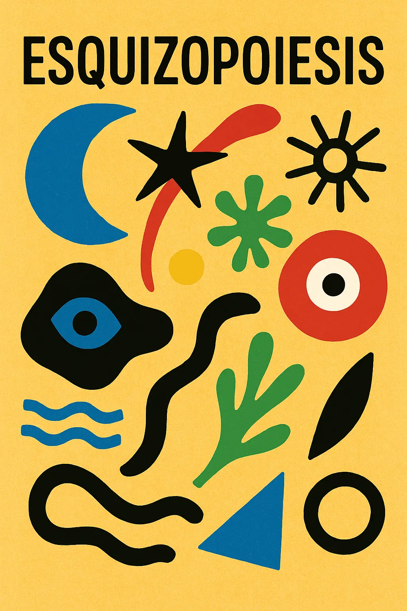
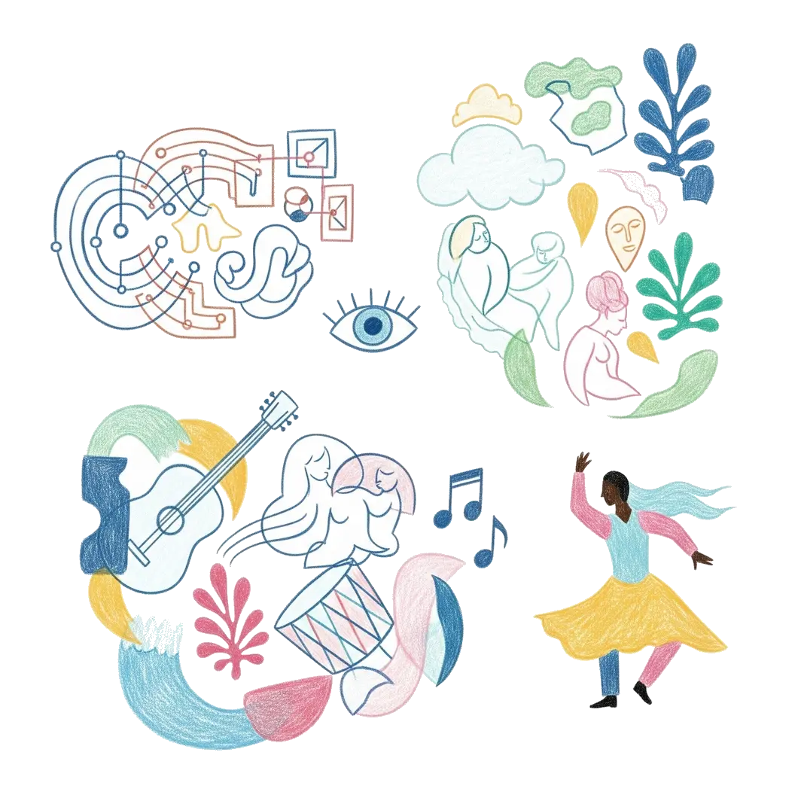
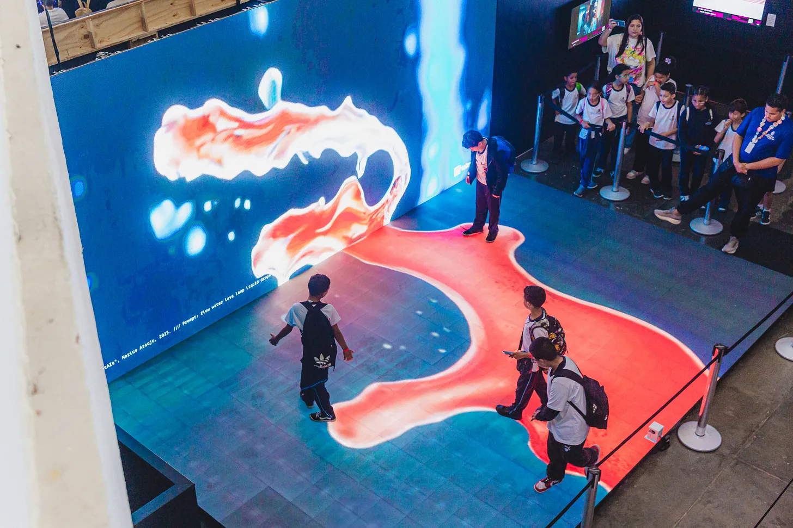
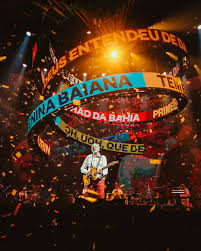
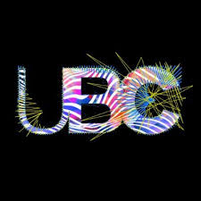
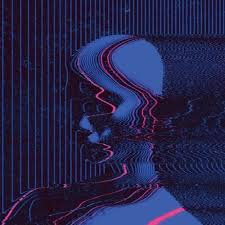
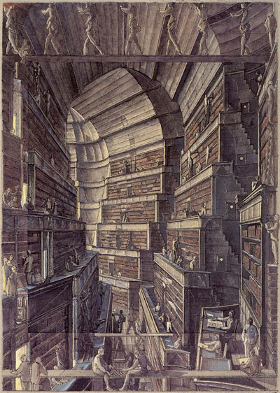

Title: Esquizopoiesis - Arte Generativa, Sonhos e Música Brasileira
Tags: I.A., Futurismo, Arte
Author: Frederico Flores
Date: 2025-08-20 10:20

> "O universo não é uma ideia minha.  
> A minha ideia de universo é que é uma ideia minha.  
> A noite não anoitece pelos meus olhos.  
> A minha ideia de noite é que anoitece pelos meus olhos.  
> Fora de eu pensar e de haver quaisquer pensamentos  
> A noite anoitece concretamente  
> E o fulgor das estrelas existe como se tivesse peso."  

— Alberto Caeiro (Fernando Pessoa) 

Neste mês de agosto, a cidade do Rio de Janeiro recebeu o **<a href="https://rioinnovationweek.com.br/" target="_blank">Rio Innovation Week</a>**, um festival de encontros, conversas e palestras que, como o nome em inglês já denuncia, trata de inovação em áreas que vão de saúde a políticas públicas. E, claro, com muita arte e tecnologia na pauta.  

Quando ganhei meu passaporte para os quatro dias de evento, o clima estava frio e nublado, eu estava gripado, e confesso: a ideia de me juntar a uma enorme plateia em um galpão fechado para ouvir influenciadores digitais discutirem sobre as mais novas  
<a href="https://chat.openai.com/?q=%22Um%20artigo%20sat%C3%ADrico%20sobre%20as%20%C3%BAltimas%20buzzwords%20utilizadas%20por%20marketeiros%2C%20techbros%2C%20e%20gente%20do%20linkedin%20em%20geral.%22" target="_blank"><b>Buzzwords</b></a> do momento não me animava. De influenza já bastava a que estava instalada nos meus brônquios. Então, nem olhei com atenção a extensa programação. Sabia apenas que haveria muita Inteligência Artificial associada aos mais diversos temas.  

No entanto, na terça-feira, quando o evento começou, o sol voltou, a dipirona fez o seu trabalho, e eu acordei animado com a possibilidade de deparar com o novo. Peguei o metrô, depois o VLT e, chegando no Pier Mauá, uma ótima surpresa: havia um palco exclusivo sobre o mercado da música, **<a href="https://www.instagram.com/musicforwardbrasil/" target="_blank">Music Forwad</a>**, promovido pelos ídolos da Tecla Music. Dali não saí mais. Voltei todos os quatro dias seguintes. Foi intenso: conheci pessoas e trabalhos que eu nem imaginava, fiz contatos novos e, ao final, tive uma epifania que resultou na criação de uma palavra: **Esquizopoiesis**.  

Um termo que define o rompimento entre o impulso de criação e o seu criador. Uma palavra que, ouso dizer, poderá ser muito usada daqui para frente — caso este artigo viralize. Estou orgulhoso. Não é todo dia que alguém que não se chama **Guimarães Rosa** ou **Carlinhos Brown** inventa uma palavra nova decente.

  

Mas longe de mim querer assumir os louros sozinho. Ninguém cria sozinho. Eu estive exposto a uma série de ideias, de pessoas, que me fizeram refletir até chegar a esta conclusão. Diferente da OpenAI, que não cita suas fontes, eu consigo atribuir o devido crédito a quem me inspirou nesses dias. E faço questão de citar as palestras que mais me marcaram:  

### 👾 Visual Flow: Programação visual em tempo real com <a href="https://derivative.ca/" target="_blank">TouchDesigner</a> – <a href="https://www.instagram.com/marlus.xyz/" target="_blank">Marlus Araújo</a>  
Adorei conhecer o <a href="https://derivative.ca/" target="_blank">TouchDesigner</a>, um software de programação visual semelhante ao <a href="https://cycling74.com/products/max" target="_blank">Max/MSP</a>, conhecido por nós músicos. Foi um teletransporte direto para minha época de faculdade, nas aulas de composição eletroacústica com <a href="https://www.babelscores.com/es/composer?userid=9877&view=vendorprofile" target="_blank">Mauricio Dottori</a>: geradores, osciladores e filtros combinados para criar o que se chama de **arte generativa**.  

Saí da palestra cheio de ideias para aplicar nos cases dos clientes que usam o nosso **<a href="https://moods.com.br" target="_blank">Player Moods</a>**: vitrines que reagem à presença do público, projeções interativas em chão, teto e parede da loja, e muito mais.  

### 💿 Memória, Música e Inteligência Artificial – <a href="https://www.instagram.com/poetacleberaugusto/" target="_blank">Cleber Augusto</a>, <a href="https://www.instagram.com/alessandrocardozo13/" target="_blank">Alessandro Couto Cardozo</a>, <a href="https://www.instagram.com/ferrugem/" target="_blank">Ferrugem</a>  
Uma história emocionante sobre como utilizaram o aprendizado de máquina para reconstruir a voz de <a href="https://www.instagram.com/poetacleberaugusto/" target="_blank">Cleber Augusto</a> em seu mais novo album. Ele próprio dirigiu a interpretação de outros cantores nas suas músicas, e com o software reconstruiram o seu timbre de voz pessoal. Um exemplo único no mundo de como a tecnologia pode potencializar o artista.  

[Cleber Augusto - Minhas Andanças](https://open.spotify.com/album/3yPJ9jMG3NUaCYKPsfrGNL?si=blBv1K_DTI6v6MBowWL5Ug)

### 📻 15 anos do Festival Novas Frequências – <a href="https://www.instagram.com/chicodub/" target="_blank">Chico Dub</a>  

Em tempos de atenção fragmentada e produção automatizada de áudio e vídeo, a experiência de shows ao vivo se mostra urgente. Aposto que a overdose de artistas gerados por IA vai banalizar a suposta “sonoridade comum” dos estilos musicais — e o público vai buscar, cada vez mais, <a href="https://www.novasfrequencias.com/" target="_blank">"novas frequências"</a> .  

[Novas Frequencias](https://www.instagram.com/p/DNDodNRun28/)

### 👩‍🚀 Narrativas Espaciais: design, tecnologia e experiência em projetos imersivos – Débora Marquesi

Em tantos anos trabalhando com marcas, foi a melhor síntese que já vi de como a história a ser contada guia a experiência que uma marca quer passar. 
A palestra de Debora Marquesi foi inspirada, e envolveu o público, começando com um convite para perguntarmos a pessoa que sentava em nosso lado, qual era a história do nome dela. E para minha surpresa meu vizinho de platéia também se chamava Frederico.

Me rendeu algumas anotações que usarei daqui para frente em cada novo projeto.

- **Fundamento da jornada dos sentidos:** Storia ➡ Sentido ➡ Memoria

- **Design de Experiência:** é antecipar as sensacoes

- **Brand Experience:** Não é o que a marca diz mas o que ela faz sentir

É impressionante a capacidade técnica da equipe da Chroma Garden — na combinação de diferentes tecnologia para criarem experiências físicas, sonsoriais, ricas em significado. Inteligência real, humana, é o que o Brasil tem de sobra.  

[Chroma Garden](https://www.instagram.com/p/DIb979avDD3/?img_index=1)

### 🇧🇷 Do Som à Imagem: O Projeto Visual da Última Turnê de <a href="https://www.instagram.com/gilbertogil/" target="_blank">Gilberto Gil</a> – <a href="https://www.instagram.com/zandaniguan/" target="_blank">Fernanda Guizan</a>, Pedro Antonio Garavaglia, Olivia Ribeiro Ferreira, Eduardo Carvalho dos Santos  
Sempre que nos deparamos com a obra de Gil, lembramos porque temos orgulho de ser brasileiros. Em nenhuma das grandes turnês globais recentes vi um LED em formato tão único quanto aquele espiral criado para o palco do Gil.  

Além do tema da palestra, tive vontade de levantar a mão e perguntar por que, em tempos de IA, não incluíram **Cérebro Eletrônico** na playlist. Afinal, nesta letra Gil preveu o debate atual, e já deu todas as respostas. A criação humana tem origem na vida que sabe que um dia vai morrer. Acho que poderia provocar um debate relevante na hora, mas, deixei a minha timidez habitual prevalecer e guardei o assunto para este texto.

### 🤖 Autores, compositores e algoritmos: criar ainda é humano? – Ricardo Moreno, <a href="https://www.instagram.com/pietroreis/" target="_blank">Pietro Reis</a>, <a href="https://www.instagram.com/julia_mestre/" target="_blank">Julia Mestre</a>  
Uma discussão fundamental sobre os direitos autorais apropriados pela maioria dos serviços de inteligência artificial generativa. Julia Mestre explicou como a UBC está atuando [no Congresso Nacional para regulamentar essa prática das Big Techs](https://www.ubc.org.br/publicacoes/noticia/23363/comissao-do-pl-da-ia-na-camara-ja-traz-desafios-ao-direito-autoral).

O tema esteve presente em outros palcos, onde pude notar algumas vezes a relativização da apropriação de direitos autorais, talvez uma tendência a classificar a IA como algo generalizado ou “inevitável”. Eu digo que não é, pois a forma sempre antecede o conteúdo. 

Contra a visão de uma tecnologia neutra, eu gostaria de distribuir antes desses debates uma cópia do excelente artigo 
**<a href="https://revistas.marilia.unesp.br/index.php/orgdemo/article/view/411/311" target="_blank">O Fetiche da Tecnologia</a>**, de Henrique Novaes,  onde se le:

> "Por ser a  tecnologia uma construção social -um campo de batalha -historicamente determinado, sendo resultado de um processo onde intervêm múltiplos atores com distintos interesses, a trajetória de inovação científica e tecnológica poderia ser redirecionada, dependendo da capacidade dos atores interessados na mudança social

No sábado, após o evento, acordei com dores musculares — talvez resquícios da minha virose recente ou das caminhadas entre sol e ar-condicionado gelado do evento. Tomei dipirona novamente, óleo de CBD, e minha cabeça começou a girar. Uma nuvem de palavras-chave se materializou na minha neve visual: O Cérebro Eletrônico de Gilberto Gil + Inteligência Artificial + Sonhos + Sidarta Ribeiro

Me perguntei se tinha visto Sidarta Ribeiro em algum palco do RiW ou se sonhei acordado. Certamente ele já esteve em alguma edição do Rio Innovation Week. 

>Será que as IAs sonham com *OvelhasGPTs*?  

Até que veio a epifania e levantei-me subitamente com uma palavra nova na mente: **Esquizopoiesis!**  

**Esquizo** – do grego, dividir, separar.  

**Poiesis** – do verbo grego *poiein*, ação de fazer, criar. É todo agir criativo ou essencial.  

A resposta que eu buscava estava no fenômeno que eu acabava de experimentar, e sua potência: pessoas elaborando pensamentos e falas em tempo real. Eu jamais experimentaria o mesmo assistindo essas palestras pelo youtube. Foi o contato direto com as pessoas que provocou uma mudança no meu diálogo interno.

Inteligências artificiais generativas são ferramentas poderosas, mas como arte eu aposto na tendencia de que será consumida como uma forma de entretenimento em si mesma. O público ao invés de navegar em infinitas bibliotecas de conteúdo gerado por I.A.,  vai preferir gerar o seu próprio conteúdo em tempo real — e pagar por esse tipo de entretenimento. E enquanto vivermos em uma sociedade capitalista, os criadores cujas obras alimentaram o aprendizado de máquina desses provedores de serviços, são merecedores de todos os royalties a que têm direito. Estamos falando de um "streaming" de fragmentos poieséticos.

Como experimento e para ilustrar esta explicação, fiz a geração de uma nova música no site <a href="https://suno.com/" target="_blank">Suno</a>. Cantando sobre este assunto:  

[Geração Digital - Plagiadora Oficial](https://youtu.be/bscbehcX8cA?si=bnZzsBlzdlFZSMDu)

> "Roubaram meu canto, sem pedir licença, Copiaram o encanto, travestiram de ciência.
 Minha alma virou dado, na nuvem artificial, Chamaram de progresso o saque cultural. /
 IA, ia, iaiá,
 Plágio travestido de genialidade.
 IA, ia, iaiá,
 Repete meu samba sem pagar vaidade.
/ 
 Slop, flop, drop, pop, Copia, cola, corta, crop.
 Cria que cria, mas cria roubado, Arte latada, feed pasteurizado.
/ 
 É datavórtex, é neuroniquente, É plagiomática, é copyfluente.
 Techbrodossauro vende disruptência, Mas não paga o samba da nossa existência.
/ 
 No boteco da esquina, tem rima original, Na roda de criança, tem canto visceral.
 Na boca da IA, só sobra sinal, Um eco vazio, um truque digital.
/ 
 IA, ia, iaiá,
 Plágio travestido de genialidade.
 IA, ia, iaiá,
 Repete meu samba sem pagar vaidade.
/ 
 Se tudo é dado, nada é dado de graça.
 Se tudo é arte, cadê a praça?
 / No fim, a maior buzzword: Inteligência Artificial, Prazer sou eu a plagiadora oficial."
 
-ChatGPT (treinado no repertório da União Brasileira Dos Compositores)
 

Eu até que me orgulho do resultado que consegui depois de alguns ajustes na letra. Me senti co-criador por não mais do que um minuto. Mas quem escutar atentamente o resultado terá uma estranha sensação de miragem: fragmentos de estilos e vozes parecem emergir como ecos reconhecíveis: Maria Rita, Emicida, talvez Claudia Leitte ou Vanessa Rangel, mas, assim que se delineiam, logo se desfazem no ar, dissolvidos em outro timbre, em outro fraseado musical característico. O efeito é um mosaico instável de influências, feito de cintilações que nunca se fixam, justamente porque à máquina falta o núcleo vital da criação.

As big techs poderiam — e, sinceramente, deveriam — colar aos seus serviços um cálculo de quanto cada obra protegida por direitos autorais foi utilizada para os pesos e treinamentos que geraram cada resposta, para que parte da grana das mensalidades desses serviços possam ir direto para os artistas, e outra parte para a educação em arte. Tipo um regime de royalties do petróleo poético: você extrai, mas tem que devolver algo ao solo de origem.

#### ⌨️ <a href="https://chat.openai.com/?q=%22Um%20pseudocódigo%20de%20algoritmo%20para%20calcular%20a%20porcentagem%20de%20diretos%20autorais%20devidas%20em%20cada%20resposta%20gerada%20por%20um%20serviço%20comercial%20de%20I.A.%20generativa%20treinada%20com%20conteúdo%20protegido%20por%20direitos%20autorais" target="_blank"><b>Algo conceitualmente simples de ser implementado!</b></a>

---

O musicólogo Murray Schaffer,  propos em seu livro *<a href="https://monoskop.org/images/2/21/Schafer_R_Murray_O_ouvido_pensante.pdf" target="_blank">O Ouvido Pensante</a>* o termo **esquizofonia** para se referir a separação do som de sua fonte original. Fenômeno que surgiu a partir da invenção dos equipamentos eletroacústicos para transmissão de som, que permitiram gravar e enviar qualquer som para qualquer lugar do mundo. Antes disso, cada som era único e inseparável de sua fonte.  

O século XX, com suas formas industriais de mídia, possibilitou a difusão massiva de criações, mas que carregavam a representação de sua forma poética. Uma exopoiesis. Agora com o escalonamento do conteúdo "generativo" vivemos um novo paradigma: fragmentos de formas separados de seus criadores para compar a resposta a um comando. 

>"Poiesis é um substantivo que se forma do verbo grego poiein. Este assinala no grego a ação de fazer diversificada, mas sobretudo a questão da essência do agir, daí estar ligada à poiesis, no sentido que hoje consideramos criação. Esta pressupõe um fazer surgir, um figurar algo a partir do nada, ou no pensamento mítico, a partir da Terra, e mais tarde a partir da physis. Mas o que é o nada, a Terra, a physis? São estas questões que remetem para a essência do agir. Poiesis é, pois, todo agir criativo ou essencial."

-[Manuel Antônio de Castro](https://travessiapoetica.blogspot.com/2006/09/perguntas-sobre-entrevista-de-rosa-05.html)

A experiência com ferramentas de IA generativa é semelhante a experiência de sonho lúcido. Podemos simular mundos possíveis, sem objetivo prático, um fim em si mesmo. Aqui nos deparamos com **[A Biblioteca de Babel](https://site.ufvjm.edu.br/cafeliterario/a-biblioteca-de-babel-jorge-luis-borges/)**, de Jorge Luis Borges, que imagina uma biblioteca infinita, cujas páginas dos livros contem todas as combinações aleatórias possíveis com as letras do alfebato, e por isso acaba contendo todos os livros já escritos e todos os que ainda poderiam ser. 

Primeiro se deslumbra com a promessa de conhecimento absoluto; depois, sucumbe-se ao peso opressor de um labirinto no qual o sentido se dissolve entre ruídos indistintos.

<iframe width="100%" height="60" src="https://player-widget.mixcloud.com/widget/iframe/?hide_cover=1&mini=1&feed=%2Ffredfs99%2Fthe-library-of-babel-jorge-luis-borges%2F" frameborder="0" allow="encrypted-media; fullscreen; autoplay; idle-detection; speaker-selection; web-share;" ></iframe>

[Audio Book - The Library Of Babel](https://www.mixcloud.com/fredfs99/the-library-of-babel-jorge-luis-borges/)

Em **<a href="https://libraryofbabel.info/" target="_blank">libraryofbabel.info</a>**, idealizado e programado por Jonathan Basile, o algoritmo recria a Biblioteca de Babel, sendo assim todas as combinações possíveis de 3 200 caracteres podem ser encontradas em seus livros. Ao navegar, com o devido tempo que pode ser de 1 minuto, 1 milhão de anos ou ao infinito, você pode tropeçar em texto que já existe, e até naquele que ainda não foi escrito, inclusive tudo o que um dia será. É só o olhar humano que pode identificar. A Biblioteca de Babel é um acervo **esquizopoiesético**.

A inteligência artificial generativa organiza um mosaico de intenções cristalizadas em matemática de rede neural para estruturar uma resposta a uma requisição do usuário. Sua matéria prima, o conteúdo que serviu para gerar seu treinamento e pesos, agora pela primeira vez na história estão separadas da suas intenção de criação. O ser humano é o único portador possível da poiesis, que acende — como Prometeu — o fogo que ilumina a escuridão.

  
> "O cérebro eletrônico faz tudo  
> Faz quase tudo  
> Faz quase tudo  
> Mas ele é mudo  
> O cérebro eletrônico comanda  
> Manda e desmanda  
> Ele é quem manda  
> Mas ele não anda  
> Só eu posso pensar  
> Se Deus existe  
> Só eu  
> Só eu posso chorar  
> Quando estou triste  
> Só eu  
> Eu cá com meus botões  
> De carne e osso  
> Eu falo e ouço. Hum  
> Eu penso e posso  
> Eu posso decidir  
> Se vivo ou morro porque  
> Porque sou vivo  
> Vivo pra cachorro e sei  
> Que cérebro eletrônico nenhum me dá socorro  
> No meu caminho inevitável para a morte  
> Porque sou vivo  
> Sou muito vivo e sei  
> Que a morte é nosso impulso primitivo e sei  
> Que cérebro eletrônico nenhum me dá socorro  
> Com seus botões de ferro e seus  
> Olhos de vidro"  
 
— Gilberto Gil

[Gilberto Gil - O Cérebro Eletônico](https://youtu.be/ygu7Np-WRWc)

