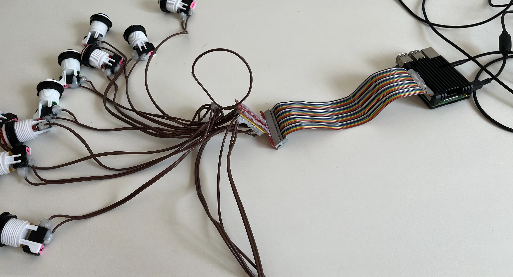
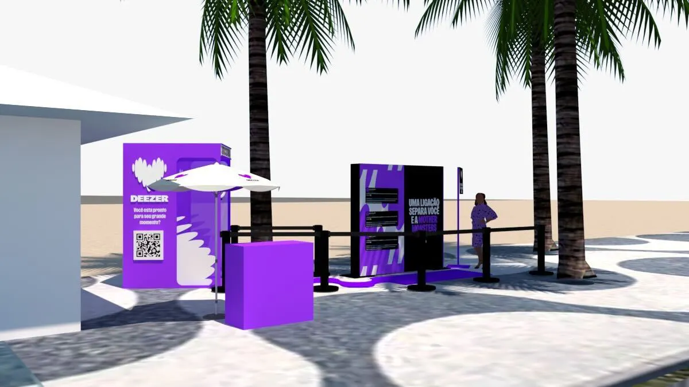

Title: Gaga Sampler - Uma ativacão para a Deezer
Tags: sound design, music branding, projetos
Author: Frederico Flores
Date: 2025-07-29 10:20

O propósito da Jardim Sonoro é desenvolver ideias musicais. No dia a dia, isso significa criar playlists — muitas delas — para as marcas que confiam na gente. Confesso: eu amo fazer playlists. Faria até de graça. Mas existe um tipo de alegria ainda mais rara, que chega para mim a demanda por um projeto musical inédito, como por exemplo o criar uma experiência musical imersiva, montar uma instalação sonora ou desenvolvimento de sound design.
O caso que quero contar aqui teve tudo isso junto.

Em março de 2025, recebi uma mensagem da Júlia Paula, mente brilhante por trás do @studio.queen. Ela me convidava para criar sons para um projeto secreto desenvolvido pela gigante @mangolaboficial. Algumas semanas depois, a revelação: tratava-se de uma ativação de marca para a @deezerbr, em pleno calçadão do Arpoador, no Rio de Janeiro — e o motivo? Nada menos do que um show da própria @ladygaga, a Mother Monster.

A ficha talvez ainda não tenha caído. Parece inacreditável: tantos ícones reunidos num só projeto. 
O projeto criada pelo time de arquitetas e designers do Studio Queen era uma cabine telefônica cenográfica, no formato de um jogo analógico interativo, onde fãs da Lady Gaga poderiam brincar e, com sorte, ganhar convites para a área VIP do show. O conceito era puro suco de gamificação: fichas, sequências lógicas, botões coloridos, efeitos sonoros nostálgicos… E muito Abracadraba.

Assim nasceu o Gaga Sampler:
👉 https://jardimsonoro.com/gagasampler
(protótipo do jogo em versão digital, que depois virou uma cabine analógica na ativação)

Com o conceito definido, o desafio foi transformar isso em uma mecânica física funcional — com botões reais, sons sincronizados, uma interface híbrida analógico-digital. Aqui entra o lado tecnológico da Jardim Sonoro: além de músico, sou engenheiro da computação, e nesse projeto tive a honra de contar com a parceria extra do genial Marlon Souza, engenheiro e hacker de primeira, afinal não é sempre que desenhamos o som de uma moeda sendo inserida no slot machine, e logo em seguida soldamos os cabos de um botão de arcade.

O cérebro eletrônico do jogo foi enviado para a marcenaria e No dia D, tudo foi montado bem ali, de frente pro mar de Ipanema, sob o céu azul e a expectativa no ar.

Mais emocionante do que o periodo de desenvolvimento  foi ver a reação dos fãs ao vivo. Cada botão, som, lógica e efeito foram pensados para proporcionar alegria e surpresa — e isso ficou visível nos rostos de quem passou por lá.

[vídeo com os fãs interagindo]

Foram seis horas seguidas de ativação. No fim da tarde, todos estávamos meio “Zombie Boy”… mas com o coração cheio.

E havia ainda mais por vir. Uma eletricidade especial pairava no ar do Rio de Janeiro na véspera do grande evento. E que evento! Na noite seguinte, Lady Gaga subiu ao palco, fez questão de mencionar o projeto, tocou, falou e reafirmou em alto e bom som:
“The music matters!”

https://youtu.be/zLKOawrVFjI?si=4SKHUW7As9G0iSVT

✨ Obrigado, Mangolab, Júlia Paula, Barbara Boy, e claro, Lady Gaga.
Na Jardim Sonoro, a gente acredita:
A música importa. Sempre.

