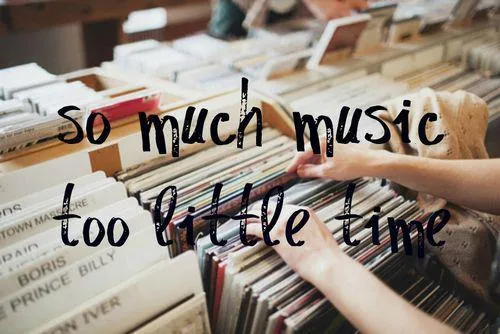
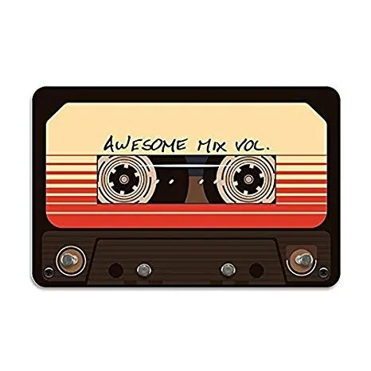
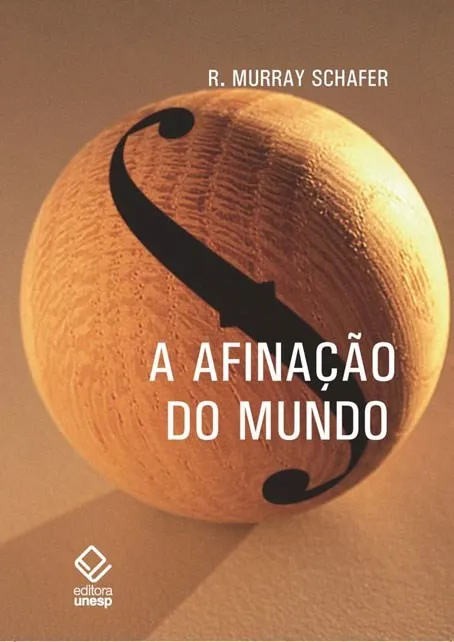

Title: Quanta música é suficiente? Alguns insights sobre Music Branding.
Tags: playlists, music branding
Author: Frederico Flores
Date: 2024-03-03 10:20

Este ano, minha empresa [Jardim Sonoro](https://jardimsonoro.com) completa 15 anos de curadoria musical para algumas das marcas mais legais do Brasil.

Com orgulho, posso dizer que nomes como o Grupo Boticário, Tasty Salad Shop e Mont Blanc se tornaram um pouquinho mais musicais quando nossos caminhos se cruzaram.

Essa jornada começou enquanto eu cursava Música na UFPR, e o mesmo tempo, ganhava experiência como DJ em diversos tipos de eventos. Logo, passei a ser procurado como “fazedor de playlists” por amigos, familiares e seus conhecidos.  

Na verdade, desde criança eu gostava de passar tardes criando mixagens em fita K7 no estéreo do meu pai.

A vocação virou demanda — para lojas, bares e restaurantes — e logo me vi abrindo uma empresa. Na hora de escolher o nome, estava terminando de ler *A Afinação do Mundo*, de Murray Schafer. Um dos capítulos citava o termo **Jardim Sonoro**. Foi um estalo imediato. E assim nasceu o CNPJ: **Jardim Sonoro Produções**.

> No livro de Schafer, Jardim Sonoro é um local onde se escutam apenas sons da natureza.  
> No meu Jardim Sonoro tem muito Rock, Jazz, Blues, Soul, House, Dub, Samba...

O trabalho de *Music Branding* consiste em pesquisar música diariamente e realizar curadorias específicas para cada cliente.

> **Quanta música é suficiente?**  

A música tem um papel essencial na vida — para muitos, é tão vital quanto respirar. A ciência mostra que ela ativa todo o sistema límbico, responsável pelas emoções e pelo controle da memória[^1].

Além disso, há evidências de que a música foi uma das primeiras formas sofisticadas de comunicação e expressão humana[^2], antecedendo a linguagem falada. Ela transmite emoções, intenções e conecta pessoas de maneira simbólica e profunda.  

Essa força ancestral torna a música uma ferramenta poderosa — tanto na vida pessoal quanto nos negócios.

O trabalho de curadoria musical envolve acompanhar selos, publicações, comunicadores da área e alimentar continuamente um bancos musicais com mais conteúdo.

Uma trilha sonora bem escolhida transforma o ambiente, e fortalece o vínculo com a marca, cada faixa é uma peça na construção da atmosfera desejada. 

No fim do dia, faço isso porque amo música. Acredito que uma canção pode transformar o seu dia — e talvez o mundo.

Uma música que representa bem essa sensação:

### [**Beatles – Here Comes The Sun**](https://www.youtube.com/watch?v=vfXtjcw9MFM)

> A letra, “Aqui vem o Sol, meu bem” pode ser sobre renascimento, revelação, ou sobre o momento mágico da criação musical.

Essa versão faz parte da trilha do filme *Yesterday* (2019), cujo argumento propõe uma brincadeira: **como seria o mundo sem as músicas dos Beatles?**

E eu gostaria de finalizar aqui com a pergunta:
**O que seria de nós sem as músicas que amamos?**

[^1]: Lutz Jäncke. *Music, memory and emotion.* [https://pmc.ncbi.nlm.nih.gov/articles/PMC2776393/](https://pmc.ncbi.nlm.nih.gov/articles/PMC2776393/)
[^2]: Benítez-Burraco, A., & Nikolsky, A. (2023). *The (Co)Evolution of Language and Music Under Human Self-Domestication*. Human Nature, 34(2), 229–275. [https://pmc.ncbi.nlm.nih.gov/articles/PMC10354115/](https://pmc.ncbi.nlm.nih.gov/articles/PMC10354115/)

