Title: O Embalo de Tenorio Jr.
Tags: cinema, bossa nova, samba jazz, mpb, brasil
Author: Frederico Flores

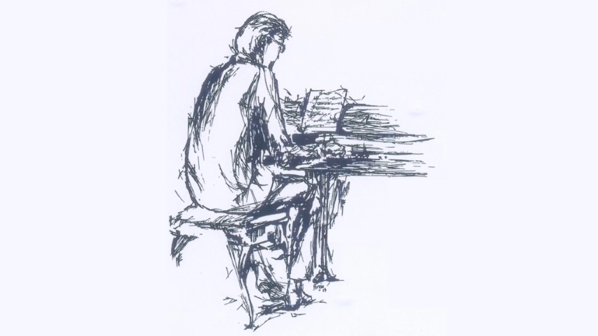

Em uma loja de discos empoeirada no Rio de Janeiro, sob a iluminação âmbar o jornalista musical Jeff Harris descobre, quase por acaso, a música de Francisco Tenório Cerqueira Júnior. A fumaça preguiçosa de cigarro paira no ar, criando um cenário quase cinematográfico. O impacto é imediato, uma epifania sonora que o lança numa busca obsessiva: quem era aquele pianista virtuoso, autor de um único e seminal álbum, *[Embalo](https://www.discogs.com/master/228723-Tenório-Jr-Embalo)*, e tragicamente desaparecido nas brumas da ditadura argentina em 1976.

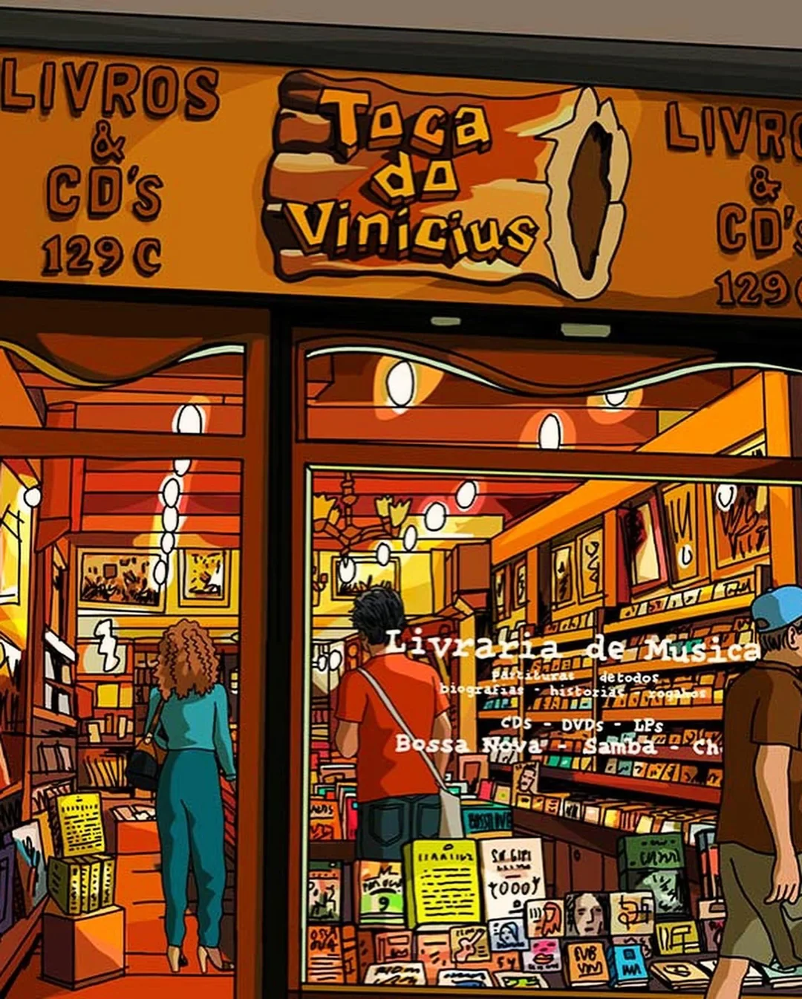

Essa cena abre o animadoc *Atiraram no Pianista* [(2023)](https://www.imdb.com/pt/title/tt11242654/?reasonForLanguagePrompt=browser_header_mismatch), dos diretores espanhóis Fernando Trueba e Javier Mariscal, servindo como portal para uma história que, por décadas, permaneceu uma ferida aberta, uma melodia brutalmente interrompida.

Jeff Harris, repórter fictício da *The New Yorker*, com a voz inconfundível de Jeff Goldblum, é um alter ego animado que espelha a jornada de descoberta do próprio Trueba e, por extensão, a do espectador. Trueba criou o personagem para escapar das armadilhas do documentário tradicional, evitando bustos parlantes lamentando um gênio perdido. Em vez disso, o filme imerge o público no vibrante mundo de Tenório Jr., um dos pianistas mais talentosos da música brasileira.

<iframe width="560" height="315" src="https://www.youtube.com/embed/heBfOfb4lXM?si=spMEqJNNvST318ge" title="YouTube video player" frameborder="0" allow="accelerometer; autoplay; clipboard-write; encrypted-media; gyroscope; picture-in-picture; web-share" referrerpolicy="strict-origin-when-cross-origin" allowfullscreen></iframe>

## Os Anos Dourados

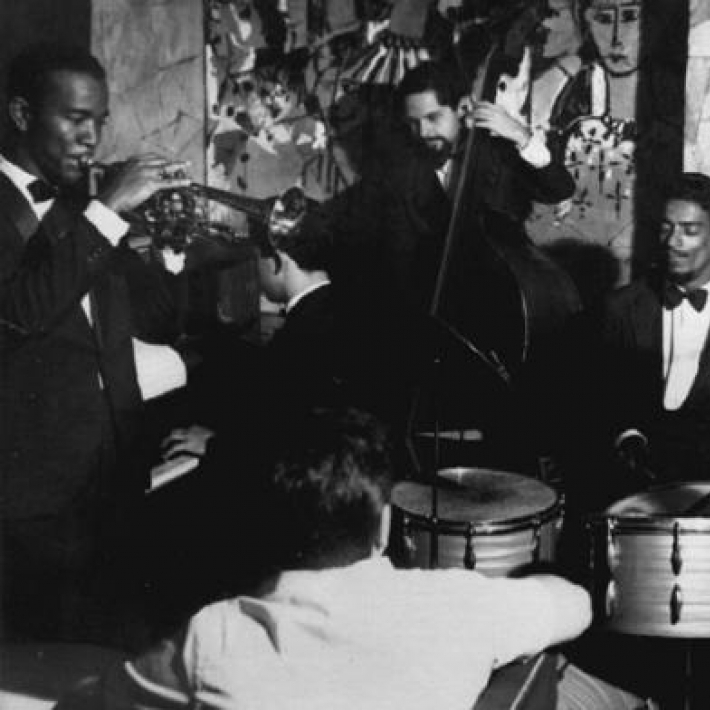

Francisco Tenório Cerqueira Júnior nasceu no Rio de Janeiro, em 4 de julho de 1941, no bairro de Laranjeiras. Já na juventude, emergiu na cena musical carioca como um talento nato, um pianista cuja habilidade parecia brotar com naturalidade, como se fosse um dom inato.

O palco geralmente era no lendário **Beco das Garrafas**, um estreito corredor em Copacabana que, entre o final dos anos 1950 e meados dos 1960, pulsava como o epicentro da modernização da música brasileira. Boates minúsculas e esfumaçadas, como o *Little Club* e o *Bottle's Bar*, eram verdadeiros laboratórios de experimentação instrumental[^1]. Ali, o samba se encontrava despudoradamente com o jazz — o bebop ágil, o hard bop visceral —, dando origem ao que se convencionou chamar de **samba-jazz**, ou, nas palavras do crítico francês Robert Celerier, uma "hard bossa nova"[^2]. As jam sessions eram rituais de pura criação, onde jovens músicos testavam limites e inventavam novas linguagens sonoras.

Nesse caldeirão sonoro, Tenório Jr. ombreava com gigantes de sua geração: 

- 🎹 Pianistas como Sérgio Mendes, Luiz Eça, Luiz Carlos Vinhas, Dom Salvador e Eumir Deodato
- 🥁 Os bateristas  Edison Machado (considerado o inventor da batida moderna de samba na bateria), Milton Banana e Dom Um Romão
- 🎸  Contrabaixistas Luiz Chaves, Tião Neto, Sérgio Barrozo, Bebeto Castilho e Jorge Marinho
- 🎷 Gigantes do sax como Paulo Moura e J.T. Meirelles, o trombonista Raul de Souza, entre outros. 

Eram músicos superdotados, muitos vindos de origens humildes, que encontravam no Beco um espaço de afirmação e virtuosismo.

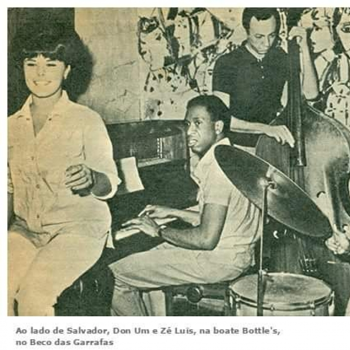

Tenório Jr. destacou-se rapidamente como um dos pianistas mais inovadores de sua geração. Seu estilo era uma fusão potente: uma base rítmica inconfundivelmente brasileira, harmonias sofisticadas com um toque impressionista e a malícia da gafieira. Sua versatilidade o tornou um acompanhante requisitadíssimo, deixando sua marca em discos fundamentais como *[É Samba Novo](https://www.discogs.com/release/3949207-Edison-Machado-Edison-Machado-É-Samba-Novo?srsltid=AfmBOooE-1bxRTJ09Ew9rWS4VB3RcpoHVlB-uUAR1FpRu_hpvKFv6Lcj)* (1964), de Edson Machado, *[Vagamente](https://www.discogs.com/release/3277136-Wanda-Vagamente?srsltid=AfmBOoroOPO5TbxvREZUKih0Xi9URCpT7KWyqYJTwt4xmMrbVxfJ_3Oc)* (1964), de Wanda Sá, e espetacular album: *[A Arte Maior de Leny Andrade](https://www.discogs.com/release/6295104-Leny-Andrade-A-Arte-Maior-De-Leny-Andrade?srsltid=AfmBOorY00JtYaPR4vJy54V5qM6YDo9ZET5iAUHBEhYsuLdvm_EEUAM6)* (1963), de Leny Andrade, que conta com uma versão ao vivo de "Embalo".

Ele também colaborou com nomes como Tom Jobim, Vinicius de Moraes, Chico Buarque, Gal Costa, Milton Nascimento, Edu Lobo, Johnny Alf.

Aos 23 anos, Tenório Jr. transitou de sideman cobiçado para líder de seu próprio (e único) álbum, *[Embalo](https://www.discogs.com/master/351128-Ten%C3%B3rio-Jr-Embalo)* (1964), com carta branca da gravadora RGE. Esse trabalho atesta seu talento precoce e o prestígio acumulado, além de capturar o otimismo de uma era que investia no potencial do samba-jazz. A liberdade criativa resultou numa obra que, em retrospecto, parece o zênite de um momento único na música brasileira.

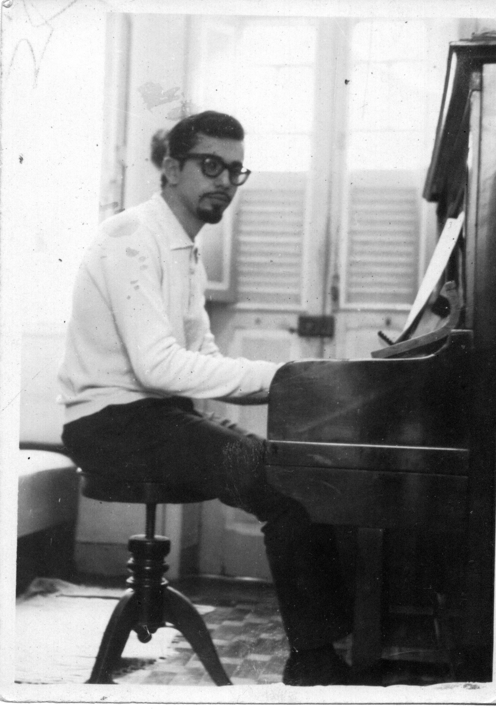

## Embalo
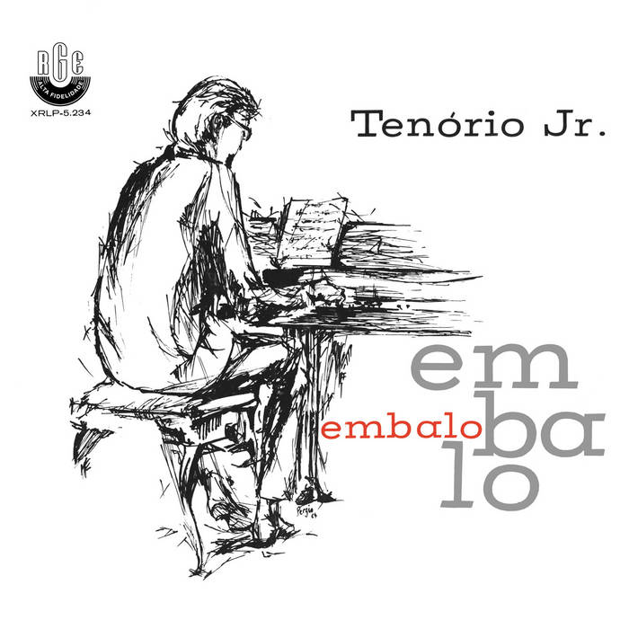

O álbum *[Embalo](https://www.discogs.com/master/228723-Tenório-Jr-Embalo)* é uma joia do samba-jazz. A faixa-título, composta por Tenório com arranjo do saxofonista Paulo Moura, abre o disco com inspiração bebop e uma pegada inconfundivelmente brasileira. A sessão de sopros brilha intensamente, enquanto Milton Banana, na bateria, sintetiza uma concepção orquestral inovadora, trazendo a essência das rodas de samba para a percussão.

Em "Inútil Paisagem" (de Tom Jobim e Aloysio de Oliveira), Tenório subverte expectativas com um arranjo engenhoso: o piano assume a melodia principal, enquanto os sopros tecem um diálogo intrincado de perguntas e respostas. O clássico "Fim de Semana em Eldorado", de Johnny Alf, é transformado num samba-jazz vibrante e energético.

 Já em "Nebulosa", uma pérola autoral, Tenório alterna momentos de lirismo melódico com improvisos vertiginosos sobre uma base rítmica pulsante e cheia de brasilidade.
 
 <iframe width="560" height="315" src="https://www.youtube.com/embed/h6VkI2Kz56o?si=-jvR4TSVmZS5WEfR" title="YouTube video player" frameborder="0" allow="accelerometer; autoplay; clipboard-write; encrypted-media; gyroscope; picture-in-picture; web-share" referrerpolicy="strict-origin-when-cross-origin" allowfullscreen></iframe>
 
 > “Tudo me foi creditado, desde a escolha dos temas e arranjos até os detalhes mais técnicos, como estúdio, engenheiro de som, capa etc. Isto contribuiu definitivamente para que eu me entregasse a diversas experiências com tipos diferentes de conjunto, tentativas minhas de arranjos, enfim, uma série de incursões num terreno que eu havia apenas tateado”. 
 
 > Tenório Jr. relata na *contracapa do album*.

## *Atiraram no Pianista*

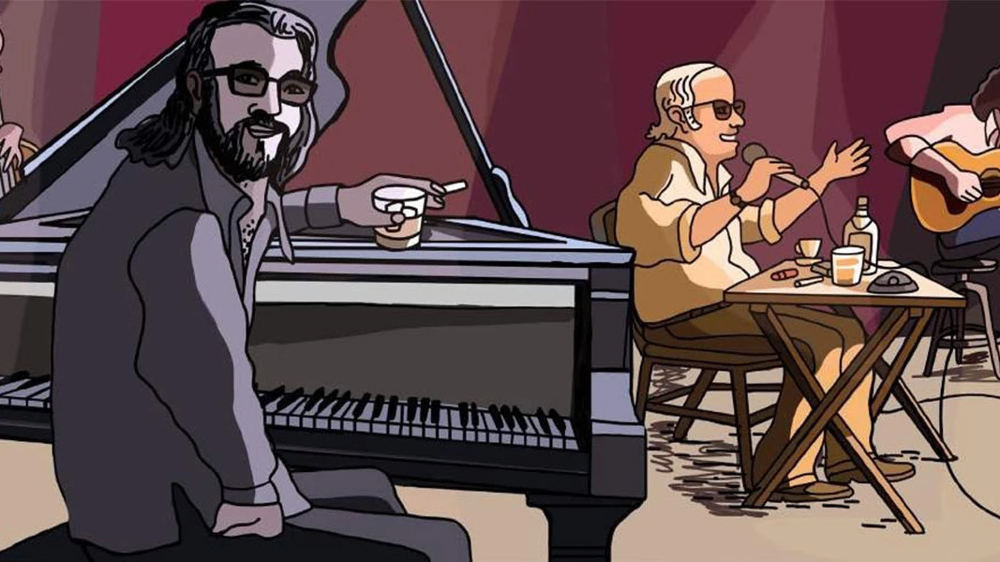

Em março de 1976, Tenório Jr. estava em Buenos Aires, integrando a banda que acompanhava Vinicius de Moraes e Toquinho numa série de shows no prestigiado Teatro Gran Rex. A capital argentina vivia dias sombrios com o terrorismo de Estado que já mostrava suas garras, prenunciando o golpe militar que deporia Isabelita Perón em 24 de março.

Na madrugada de 18 de março, após uma apresentação, Tenório retornou ao Hotel Normandie, onde estava hospedado. Por volta das três da manhã, decidiu sair, deixando um bilhete na porta do quarto de Vinicius: "Vou sair para comer um sanduíche e comprar um remédio. Volto logo." Ele nunca retornou.

O que se seguiu foi o desespero. Vinicius de Moraes, poeta e diplomata experiente, mobilizou contatos na embaixada, na imprensa, contratou advogados, percorreu hospitais e delegacias. Tudo em vão contra a máquina  da repressão argentina. 

O fato de Tenório Jr. ser um músico, sem qualquer militância conhecida, apenas sublinha a natureza indiscriminada e paranoica do terror de Estado. Sua prisão foi, ao que tudo indica, um "erro" crasso da repressão, uma confusão baseada em estereótipos. A tragédia pessoal de Tenório Jr, que aguardava o nascimento do quinto filho, converte-se, assim, num microcosmo da brutalidade que ceifou milhares de vidas, onde a simples suspeita, a aparência "errada" ou o azar de estar no lugar errado na hora errada podiam significar uma sentença de morte.

Por anos, o destino de Tenório permaneceu envolto em mistério. Apenas em 1986, confissões de Claudio Vallejos, conhecido como "El Gordo", ex-agente da Marinha Argentina que atuou no centro de detenção e tortura da ESMA, trouxeram alguma luz. Vallejos admitiu ter participado da captura de Tenório. Seu corpo, como o de tantos outros desaparecidos, nunca foi encontrado.

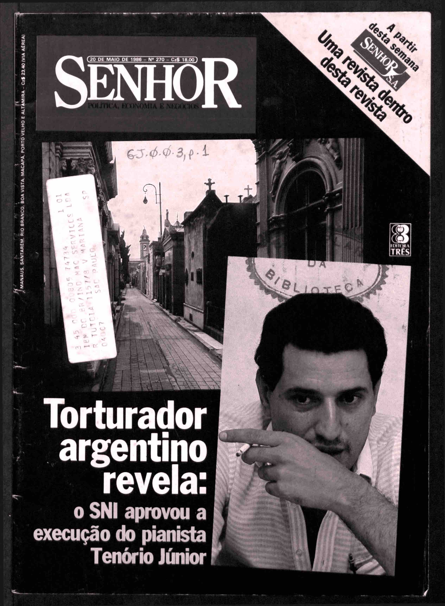

## Memória e Legado

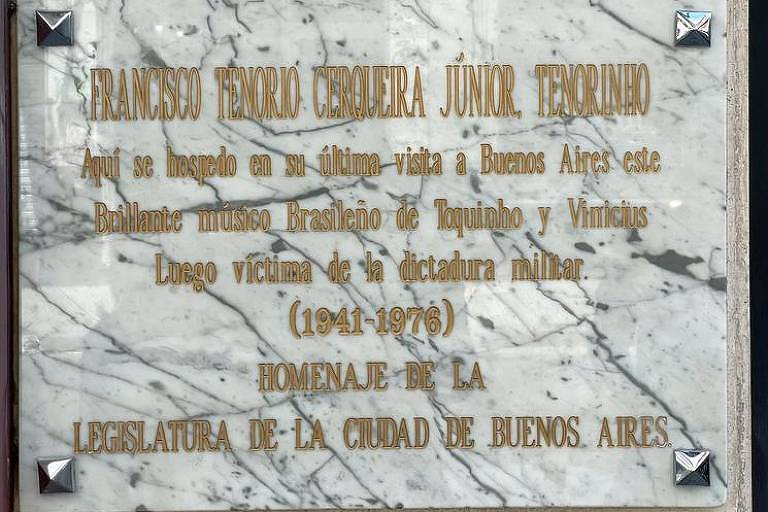

O desaparecimento e assassinato de Francisco Tenório Jr. representaram mais do que a perda de um músico talentoso: foram a interrupção brutal de uma trajetória que prometia contribuições inovadoras. Sua música, com sua fusão audaciosa de samba, jazz, bossa nova e elementos modais, continua a ecoar e inspirar músicos contemporâneos.

O filme *Atiraram no Pianista* desempenha um papel crucial no resgate dessa memória. Ao apresentar Tenório Jr. a novas gerações e contextualizar sua tragédia dentro dos crimes das ditaduras latino-americanas, oferece uma reparação simbólica, tardia, mas necessária.

Como brasileiro, é difícil não refletir sobre a ironia de um "estrangeiro" — seja o jornalista fictício, sejam os diretores espanhóis — redescobrir e revalorizar um tesouro cultural obscurecido pela violência política. Isso levanta questões incômodas sobre como o Brasil lida com seus traumas e heróis silenciados.

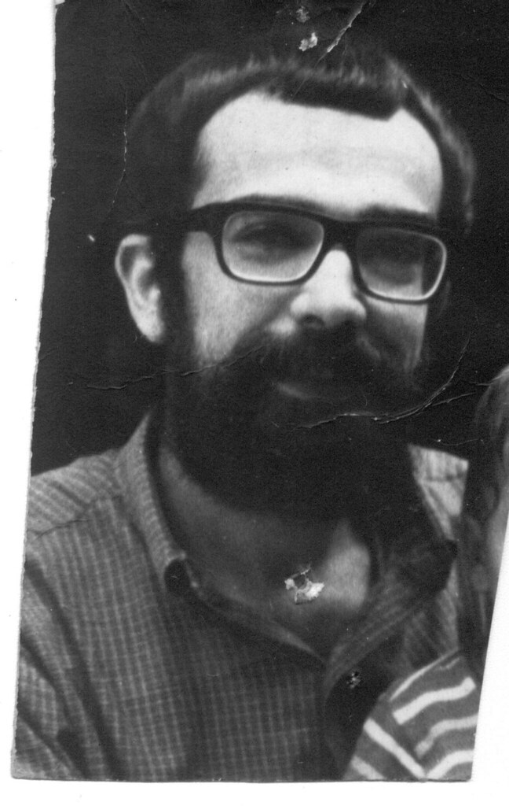
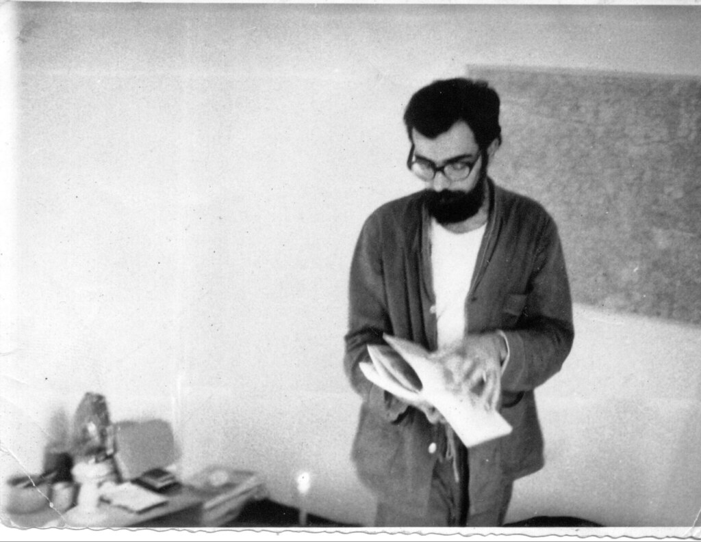

> *"Retornarán los libros, las canciones  
> Que quemaron las manos asesinas  
> Renacerá mi pueblo de su ruina  
> Y pagarán su culpa los traidores"*  
> — Pablo Milanés (*Yo Pisaré Las Calles Nuevamente*)

## Referências

Onde assistir: [Apple TV](https://tv.apple.com/br/movie/atiraram-no-pianista/umc.cmc.lq7fx75oblns6l10t00e4kfc), [Prime](https://www.primevideo.com/-/pt/detail/0MDW7IVOQMGN5U9M26H0SJQ1ZO/ref=atv_dp_share_cu_r)

[^1]: Ruiz, Renan Branco; Ribeiro Júnior, Antonio Carlos Araújo. *O fantasma de Tenório Jr. em meio às dissonâncias e disputas na historiografia do jazz brasileiro*. Orfeu, Florianópolis, v. 6, n. 1, p. 141-171, abr. 2021. Disponível em: [https://www.periodicos.udesc.br/index.php/orfeu/article/download/19611/13586/80312](https://www.periodicos.udesc.br/index.php/orfeu/article/download/19611/13586/80312)  

[^2]: Guerra, Pedro Larruba. *O Sambajazz: formação do gênero musical no Rio de Janeiro e sua relação com o contexto sociocultural da década de 1950 e 1960*. Dissertação (Mestrado em Desenvolvimento Territorial e Políticas Públicas) - Instituto de Ciências Humanas e Sociais, Universidade Federal Rural do Rio de Janeiro, Seropédica, 2018. Disponível em: [https://rima.ufrrj.br/jspui/bitstream/20.500.14407/13880/3/2018%20-%20Pedro%20Larruba%20Guerra.pdf](https://rima.ufrrj.br/jspui/bitstream/20.500.14407/13880/3/2018%20-%20Pedro%20Larruba%20Guerra.pdf)  

[^3]: Calloni, Stella (Infobae). *The terrible story of Tenorinho, the pianist of Vinicius de Moraes kidnapped at ESMA and killed by Astiz*. (2022). Disponível em: [https://www.infobae.com/en/2022/03/18/the-terrible-story-of-tenorinho-the-pianist-of-vinicius-de-moraes-kidnapped-at-esma-and-killed-by-astiz/](https://www.infobae.com/en/2022/03/18/the-terrible-story-of-tenorinho-the-pianist-of-vinicius-de-moraes-kidnapped-at-esma-and-killed-by-astiz/)

